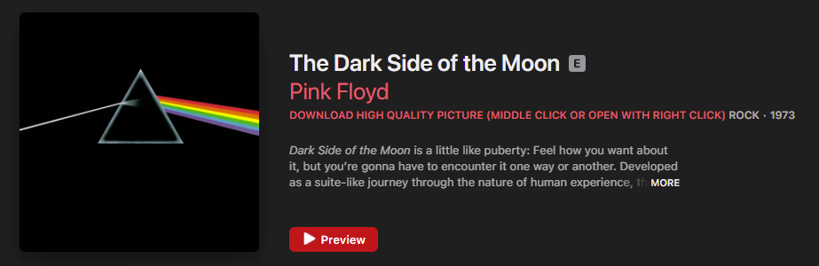

# Apple Music High Quality Pic Extractor

## Description

A Tampermonkey userscript that creates a link for getting a high quality jpg image from an [Apple Music](https://music.apple.com) album. 1200x1200 seems to be the common highest quality picture. 

Because of how [Apple Music](https://music.apple.com). loads a page only once and trigger the userscript once, the page to be refreshed each time you access an album page.

## Usage

When the album page loads, a link for the high quality pictures is created.

[Apple Music](https://music.apple.com) redirects every links to [music.apple.com](music.apple.com). That is why you need to use the middle click or "Open with right click" to get the picture. Else you'll get an error page from [Apple Music](https://music.apple.com).